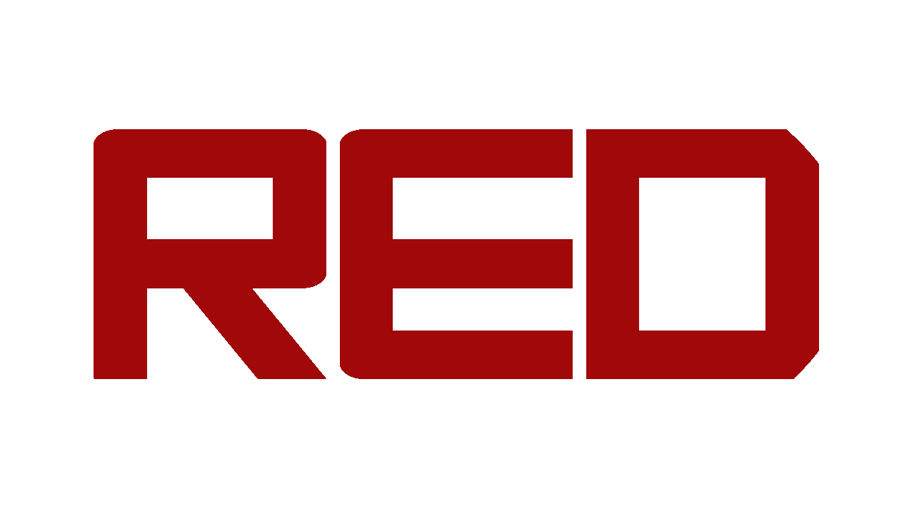
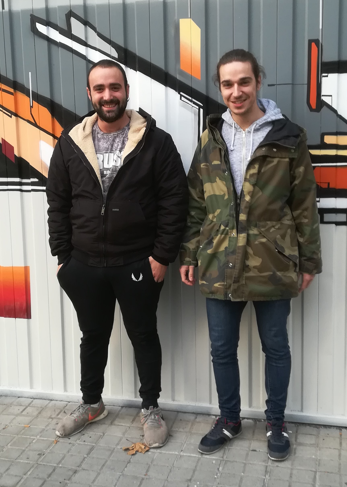

***

[Link to the repository](https://github.com/urisabate/RED)

Overview
========

Red is a 2D platformer game where the player, as Red, a nice red square that can move, has 
to avoid the pursuers to reach the final door and get to the end.

We have used a tree hierarchy system to implement the user's interface, using a cathegory 
designation to manage the functionalities of all the elements of the user's 
interface.

Red is developed by a couple of CITM's students for a Game Development subject

[Òscar Pons Gallart](https://github.com/ponspack9)

[Oriol Sabaté Solé](https://github.com/urisabate)

***

***

Gameplay
============

<video src="Red Gameplay.mp4" poster="redLogo.png" width="320" height="200" controls preload></video>

***

Game Controls
=============

**W , Space** ---> JUMP and DOUBLEJUMP / MOVING UP (GODMODE)

**A** ---> MOVING LEFT

**D** ---> MOVING RIGHT

**S** ---> SMASH ENEMIES / MOVING DOWN (GODMODE)

**Esc** ---> TO PAUSE THE GAME

Debug Keys
----------

**F1** ---> RESTART GAME

**F2** ---> RESTART CURRENT LEVEL

**F3** ---> GO TO NEXT LEVEL

**F4** ---> CAMERA FOLLOWS PLAYER/DRAG AND RELEASE MOUSE TO FREELY MOVE THE CAMERA

**F5** ---> SAVE THE CURRENT GAME STATE

**F6** ---> LOAD THE PREVIOUSLY SAVED GAME STATE

**F8** ---> SHOW AND HIDE DEBUG UI

**F9** ---> SHOW AND HIDE LOGIC (COLLIDERS & WALKABILITY MAP & ENEMIES' PATH)

**F10** ---> ENABLE AND DISABLE PLAYER'S GODMODE

**F11** ---> MANUALLY ENABLE AND DISABLE THE FRAMERATE CAP TO 30 FPS

***

Work distribution
-----------

**Oscar:**

Player main core and physics with the map. Enemy pathfinding port from oriol's base code. Game cycle and GUI cycle. Main menu, settings, pause menu and help gui and implementation. Level smooth transitions. Game adapting to make it adapt to fullscreen, except from camera. Polylines and walkability map (see innovation section). Coins and buttons parsing and reading. Logo.

**Oriol:**

Entities controller main core. Base code of enemies pathfinding. Main core of the GUI controller, functionalities assingment system of the elements of the GUI; game timer system, score system and life system among others. Animations in the GUI. All the stuff related to framerate control. Game music and sound fx, music and sound fx transitions using Oscar's base code of game cycle. Parsing and reading enemies sprites. Testing and bug searching. Level desing and adjustments.

***

Innovation
-----------

- A new system of collisions is made with the player, the map does not have any collider wrapping the
walls neither the floor, player uses the same walkable map enemies use, so there's an improvement in 
the number of colliders loaded. 

    (see Player.cpp, more accurately, Move() function)

- Spikes collision are precisely done with a polyline collision mapping, no square colliders that
overbounds them are used, there's a triangle spike so it is the collision with it.

    (see j1Map.cpp for line parsing, LoadColliders() function)
    (see j1Collision for line adding, collision checking and debug drawing. 
     AddPolyline(), CheckRectLineCollision(), DrawPolyLines(), respectively)

***

MIT License
===========

Copyright (c) [2018]

Permission is hereby granted, free of charge, to any person obtaining a copy of this software and associated documentation files (the "Software"), to deal in the Software without restriction, including without limitation the rights to use, copy, modify, merge, publish, distribute, sublicense, and/or sell copies of the Software, and to permit persons to whom the Software is furnished to do so, subject to the following conditions:

The above copyright notice and this permission notice shall be included in all copies or substantial portions of the Software.

THE SOFTWARE IS PROVIDED "AS IS", WITHOUT WARRANTY OF ANY KIND, EXPRESS OR IMPLIED, INCLUDING BUT NOT LIMITED TO THE WARRANTIES OF MERCHANTABILITY, FITNESS FOR A PARTICULAR PURPOSE AND NONINFRINGEMENT. IN NO EVENT SHALL THE AUTHORS OR COPYRIGHT HOLDERS BE LIABLE FOR ANY CLAIM, DAMAGES OR OTHER LIABILITY, WHETHER IN AN ACTION OF CONTRACT, TORT OR OTHERWISE, ARISING FROM, OUT OF OR IN CONNECTION WITH THE SOFTWARE OR THE USE OR OTHER DEALINGS IN THE SOFTWARE.
